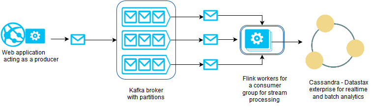
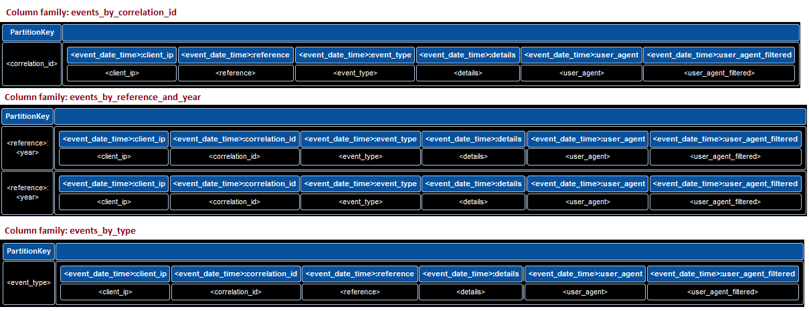

# Description

Demonstrates how one can integrate [kafka](http://kafka.apache.org/ "apache kafka"), [flink](https://flink.apache.org/ "apache flink") and [cassandra](http://cassandra.apache.org/ "apache cassandra") with [spring data](http://projects.spring.io/spring-data-cassandra/ "Spring data cassandra").

Please check the [producer module](https://github.com/viswanath7/flink-kafka-producer "Related producer module") in conjunction with this consumer for completion.

## Target architecture

In the target architecture diagram shown below, this module implements kafka flink consumers that persist json events as entities in column families of cassandra using spring data cassandra.

## Data model

Storage engine visualisation of column families stored in cassandra is as shown below

